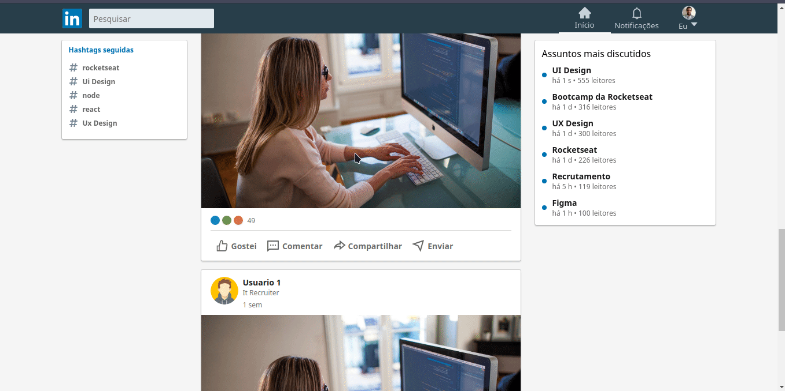

<h1 align="center">
UI Clone - LinkedIn 
</h1>

Ui clone da interface do linked in , construida para testar conhecimentos em react e css(styled components)

## Preview

## Tecnologias

- [x] React.js
- [x] Styled Components
- [x] TypeScript
- [x] Storybook

## Instalação

1. Run `npm install` or `yarn install`. 
2. Run `yarn start` and access `http://localhost:3000`. 

## Contato
☎(11) 96139-8325
📧byelg.sousa@gmail.com

## Redes Sociais

<a href="https://www.linkedin.com/in/gabriel-sousa-5a719893/">
  </img>
</a>
<a href="https://www.instagram.com/gabrielknoxx">
  </img>
</a>
